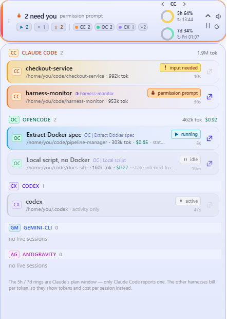
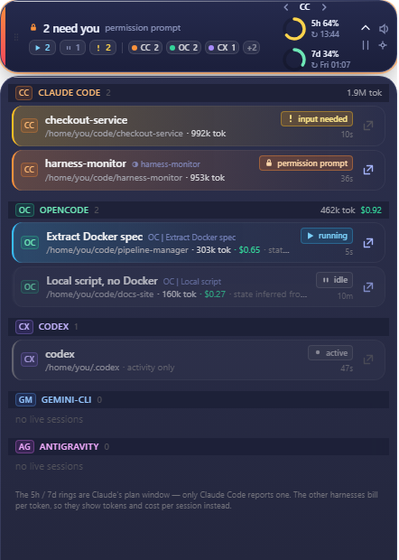
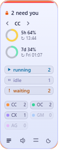

# HarnessMonitor

[](https://github.com/localhost94/harness-monitor/actions/workflows/ci.yml)
[](https://github.com/localhost94/harness-monitor/releases/latest)
[](LICENSE)

A floating widget that tells you the moment an AI coding agent stops working
and starts waiting for you.

It watches Claude Code, opencode, codex, gemini-cli and antigravity at the same
time, shows which sessions are running, idle or blocked on you, and how much of
the Claude 5-hour plan window is gone. Everything is read from files those tools
already write on your own machine: no backend, no network calls, no API keys.


The surface never changes colour with state - only the accents do: the rail
down the left edge, the glyph and its motion, and a ring around the whole pill
when something is waiting on you. Click the list icon and it expands into the
session list, where the arrow on each row jumps straight to the terminal pane
running that session.

| Expanded, light | Expanded, dark | Vertical strip |
|---|---|---|
|  |  |  |

## Install

### Windows

Grab the `.exe` for your architecture **and** `harness-monitor-agent` from the
[latest release](../../releases/latest), keep them in the same folder, and run
the `.exe`:

| Your Windows | Take these two |
|---|---|
| Intel / AMD (most machines) | `harness-monitor-x64.exe` + `harness-monitor-agent-x64` |
| Snapdragon / ARM64 | `harness-monitor-arm64.exe` + `harness-monitor-agent-arm64` |

Rename the agent to `harness-monitor-agent` (or point at it with
`HM_AGENT_PATH`) and keep it beside the `.exe`. The two must match your
architecture: the app launches the agent **inside WSL**, so an x86_64 agent
will not run on an ARM64 machine's WSL, and vice versa.

Windows 10/11 with WSL2 installed.

### macOS (experimental)

Take `HarnessMonitor-universal.dmg` from the same release - one file, no agent
half. macOS runs the adapters in-process the way Linux does, so there is
nothing to pair it with and nothing to arch-match; the dmg is universal. Drag
the app into `/Applications`.

The build is **unsigned** - there is no Apple Developer Program behind this
project - so Gatekeeper refuses the first launch. Either right-click the app
and pick *Open*, or clear the quarantine flag once:

```bash
xattr -dr com.apple.quarantine /Applications/HarnessMonitor.app
```

Experimental for two reasons: no release is smoke-tested on a Mac, and dead
sessions are not filtered there. See [Known limits](#known-limits).

### Linux

Build from source (see below) and run the binary directly.

## Why it reads what it reads

Claude Code writes one file per CLI process to `~/.claude/sessions/<pid>.json`
carrying an authoritative `status` (`idle|busy|waiting|shell`) and `waitingFor`
(`input needed` / `permission prompt`). "Finished" versus "needs you" is read,
never guessed.

Two traps that shape the whole design:

- **Nothing cleans that directory up.** On the development machine: 23 files,
  2 live processes, with dead ones frozen mid-turn for months. Every entry is
  verified against `/proc/<pid>/stat` field 22 before it is shown or diffed.
  Matching on process *name* would not work either - a live Claude Code process
  is named after its version (`2.1.259`), not `claude`.
- **`sessionId` is not unique.** Resuming a session reuses the id under a new
  pid. Session identity is `(pidDomain, pid, procStart)`.

## Architecture

One crate, one binary, two roles.

```
UI role (default)                  agent role (--agent)
  window + tray                      no GUI
  differ + notifications             runs the adapters
  reads NDJSON  <--- stdout ----     one snapshot per line
```

On **Windows** the UI process spawns `wsl.exe -d <distro> -- <binary> --agent`
and reads snapshots from its stdout. It does not read `\\wsl.localhost`: a
Linux pid is meaningless to a Windows process (they are separate pid
namespaces, so the ghost filter above could not run), and opencode's WAL
database cannot be opened safely over a 9p share. On **Linux/WSLg** the
adapters run in-process and the agent role is unused.

Adapters return a full snapshot each tick and nothing else - liveness,
transitions, dedup and delivery all live in `differ.rs`, once, for every
harness. Polling is the primary mode by design: `ReadDirectoryChangesW` does
not work over 9p and inotify does not fire on drvfs `/mnt/c`, so a filesystem
watcher would be a fallback that never runs.

## Reading the pill

The pill is 440x80 and comes in **two themes, light and dark**, both
violet-tinted on purpose: `#F2F4FF` is not the white of a Windows dialog and
`#252A4D` is not the near-black of a terminal or the neutral grey of editor
chrome, so the pill never dissolves into whatever sits behind it.

State does not repaint the surface. It shows in the accents: the gradient rail
down the left edge (orange/rose for a permission prompt, amber for input
needed, cyan/sky for a running turn, indigo/violet for idle), the headline
glyph and its motion, a coloured ring drawn around the whole pill when
something is waiting on you, and the row tints in the list.

Next to the headline sit three counts, always in the same order so they can be
read by position: **running / idle / waiting for you**. Zeroes stay visible but
dim - "nothing is waiting" is information, and a vanishing chip would shift the
other two. After a divider come the per-harness counts; harnesses that are
installed but idle collapse into a `+N` chip that still names them on hover.

Each row carries its own usage — tokens for every harness that reports them,
plus cost where the harness knows it (opencode does; a Claude subscription has
no per-session price to report). Harness headers total their group. Claude
Code's figures come from tailing the session transcript, so they are a running
total from when the app first saw that session.

On the right sits the **usage pager**: `‹ CC ›` steps through the detected
harnesses, and the choice is remembered. Claude Code is the default because it
is the only one with a plan window - its page shows **both windows**, 5-hour and
7-day, each as a ring paired with its figure - `5h 64%` on one line, the wall-clock reset time
under it (`↻ 12:22`, or `↻ Fri 00:05` when the reset is days out). The
percentage sits in the label rather than inside the ring, where `64%` cannot be
drawn legibly at 30px and a bare `64` reads as a count. A countdown
answers "how long"; a clock answers "when can I start again", which is the
thing you plan around. Hovering gives both, plus which source the reading came
from.

Every other harness pages to what it actually reports - tokens, and cost where
it knows one (`462k tok / $0.92`), or an explicit "no usage reported" rather
than a zero that would read as free.


**Only Claude Code has a plan window.** The others bill per token and expose no
equivalent, which is exactly why this pages instead of blending: a percentage of
a subscription and a token count are not comparable numbers, and stacking them
in one row would imply they are.

Per-session state is carried three ways, so colour is never the only channel:

| State | Glyph | Motion | Row |
|---|---|---|---|
| running | play | breathes (2.2s) | sky tint, sky left border |
| needs input | `!` | blinks (1s) | amber tint |
| needs approval | lock | blinks (1s) | orange tint |
| idle | pause | still | dimmed to 70% |
| activity only | dot | breathes | grey border, "activity only" note |

`prefers-reduced-motion` disables the animation.

Harnesses are told apart by a two-letter chip with its own hue - CC orange
(Claude Code), OC emerald (opencode), CX violet (codex), GM blue (gemini-cli),
AG fuchsia (antigravity) - kept outside the state palette so the two never read
as the same signal. A harness that is installed but quiet shows dimmed with a
`0`; one that is not installed is absent entirely.

When there are more sessions than fit, the list scrolls: harness headers stick
to the top so you always know which group you are reading, and anything waiting
on you sorts first - both between harnesses and inside each one - so a dozen
running sessions cannot push a blocked one below the fold.

**Two orientations.** The horizontal pill (440x80) suits the bottom of a
screen; the vertical strip (118x300) is for parking down a side, and stacks the
same information - rail across the top, the headline, the quota ring labelled
`5h used`, then the three counts as full-width rows (glyph and word on the
left, figure hard right) and the harness chips in two columns. The strip spells
the counts out in words: with no headline beside them, an icon and a number
alone do not say what is being counted.
Expanding either shape opens the same 440-wide session list, because rows are
not readable in a 118px strip. The choice is remembered across restarts.

Drag anywhere on the pill or strip (buttons and the session list excluded); the
position is remembered too. The four icon buttons are expand/collapse, mute,
orientation, and light/dark.

## Jump to a session

The list answers "which agent needs me"; the arrow on each row answers "where
is it". Clicking it focuses the terminal pane running that session.

This works through herdr - a terminal workspace manager for AI coding agents -
and only for sessions it hosts. herdr's panes already
know which agent session they contain, so the app maps session id to pane id
via `herdr agent list` and then calls `herdr agent focus <pane>`. A session id
is not itself a valid focus target, hence the mapping.

The Windows build cannot reach herdr directly (it lives in WSL, and
`~/.local/bin` is not on PATH for a non-interactive `wsl.exe --` shell), so it
re-invokes this same binary inside WSL in one-shot mode:
`harness-monitor-agent --focus <pane>`.

Without herdr the arrow greys out and says why; rows still show the terminal
tab title when it is known, which is usually enough to find the window by eye.

## Notification rules

Noise control is most of the work:

| Rule | Behaviour |
|---|---|
| Silent seed | The first snapshot - and the first after an agent respawn - sets the baseline and emits nothing |
| Edge, not level | Fires on the harness's own `statusUpdatedAt` advancing *and* the state class changing, so a transition that happened between two polls is still caught |
| Two kinds only | `needs you` (→ waiting) and `finished` (busy → idle). Sessions appearing, disappearing, or going busy are never announced |
| Cooldown | 30 s per session, absorbing the busy↔idle flapping between tool calls |
| Repeat guard | A second "needs you" for the same reason within 5 minutes is dropped |
| Global cap | 3 toasts per 10 s; the rest collapse into one summary |
| Ghosts | A session that fails the liveness check is forgotten silently - a deleted state file is not a completed turn |

## Usage numbers

The 5-hour percentage is **mirrored** from Claude Code, never derived from
token counts (the server's own figures make clear why: `extra_used_credits`
of 50253 against a limit of 10000, with the percentage field clamped at 100).

Two sources, newest reading wins:

1. `~/.local/state/harness-monitor/quota.json`, written by the statusline shim
   on every statusline render;
2. `~/.claude/llm-analytics-usage/*.jsonl`, written by a `Stop` hook if you
   have one - coarser, but needs no install.

Both are push-only from a live Claude Code process, so with every session
closed the number freezes. It is then greyed out with its age rather than
extrapolated forward.

To install the shim (wraps your existing statusline, does not replace it, safe
to re-run):

```bash
./installer/install-statusline.sh --status     # look before you leap
./installer/install-statusline.sh --install
./installer/install-statusline.sh --uninstall
```

## Harness support

| Harness | State | Usage | Source |
|---|---|---|---|
| Claude Code | full - reported by the harness | plan window | `~/.claude/sessions/*.json` |
| opencode | running/idle, inferred | cost + 5 token counters | `opencode.db` (`session`, `message`) |
| codex | running/idle, inferred | `tokens_used` | `state_5.sqlite`, `queue_1.sqlite` |
| gemini-cli | recency only | per-message tokens | `~/.gemini/tmp/*/chats/*.json` |
| antigravity | activity only | none | protobuf conversations (mtime) |

The UI labels anything below full fidelity, so an inferred state is never
mistaken for a reported one. opencode permission prompts are deliberately not
detected: the only record is a log line with no session id and no matching
"resolved" event, so a state machine built on it would latch forever.

## Build and run

Everywhere: [bun](https://bun.sh) 1.3.12+ and a stable Rust toolchain (1.77 or
newer, per `src-tauri/Cargo.toml`). The frontend is built once, then the Rust
side embeds it.

```bash
bun install
bun run build

cd src-tauri
cargo test                 # 28 tests, no GUI needed
cargo run                  # runs the app against your real sessions
cargo run -- --agent       # NDJSON snapshots on stdout
```

`cargo run` works on Linux/WSLg and macOS. On Windows the app expects to drive
an agent inside WSL, so use the script further down instead.

A release build needs `--features custom-protocol`; without it the webview
loads `devUrl` instead of the embedded assets and the app opens on "localhost
failed to connect". The `tauri` CLI passes that feature for you, plain `cargo`
does not, and the failure only shows up in a shipped build. If you ever see
that error, check the log for `frontend connected` - its absence is the tell.

### Linux

```bash
sudo apt-get install -y libwebkit2gtk-4.1-dev libsoup-3.0-dev \
  libjavascriptcoregtk-4.1-dev libgtk-3-dev librsvg2-dev patchelf

bun x tauri build --bundles deb,appimage
```

The webview stack is needed even for `cargo test`, because the crate links
against it.

### macOS

```bash
xcode-select --install     # rusqlite is vendored, so a C compiler is required

bun x tauri build --bundles dmg
bun x tauri build --target universal-apple-darwin --bundles dmg   # both arches
```

Unsigned output is fine locally, but Apple Silicon will not launch a binary
carrying no signature at all - set `APPLE_SIGNING_IDENTITY=-` to have Tauri
ad-hoc sign it, which is what CI does.

Two macOS notes that bite during development: desktop notifications only work
from the bundled `.app` (an unbundled `cargo run` has no registered bundle id,
so toasts silently do nothing), and state lands in
`~/.local/state/harness-monitor`, not `~/Library/Application Support`.

### Windows

Needs the MSVC build tools and the WebView2 runtime. Native build:

```bash
bun x tauri build --bundles nsis
```

Windows ARM cross-compiled from WSL, shipping both halves:

```bash
./scripts/build-windows.sh
```

That produces `dist-windows/harness-monitor.exe` plus
`dist-windows/harness-monitor-agent`, the Linux binary the exe launches through
`wsl.exe`. Keep them side by side, or point at the agent with `HM_AGENT_PATH`;
the distro comes from `HM_WSL_DISTRO`, else the first entry of `wsl.exe -l -q`.

### Previewing the UI

To review the UI without a desktop (or to check both themes at once):

```bash
./scripts/preview.sh 420 700 preview.png          # light, expanded
```

It builds, serves the built assets, and screenshots through headless Chrome.
Two things it works around, both of which silently produce a wrong picture:
`vite dev` never sees edits under `/mnt/c` (inotify does not fire on drvfs), and
Chrome enforces a ~500px minimum window width, so a 420px screenshot would
otherwise be a crop of a 512px layout. Append `?theme=dark`, `?collapsed`, or
`?w=<px>` to the preview URL. Opened in a plain browser the app renders fixture
data covering every state, since real sessions are rarely all interesting at
once.

## Why not one of the others

Several tools now watch AI coding sessions, and they are solving a different
shape of the problem:

| | Shape | Where it runs |
|---|---|---|
| **HarnessMonitor** | A floating pill or strip that interrupts you when a session finishes or blocks, and otherwise stays out of the way | Windows + WSL2, Linux, or macOS (experimental) |
| [agentpulse](https://github.com/jstuart0/agentpulse) | A full dashboard with prompts, responses and session history | Browser |
| [AgentBar](https://github.com/scari/AgentBar) | Menu-bar usage tracking | macOS |
| [agent-deck](https://github.com/asheshgoplani/agent-deck) | A TUI session manager - launch and switch sessions | Terminal |
| [AgentDeck](https://github.com/puritysb/AgentDeck) | A physical control surface, one key per session | Stream Deck and friends |

Pick this one if you want to be told rather than to watch, if you are on
Windows with your agents inside WSL, or if you want five harnesses in one place
with honest labelling of how much each one actually reports. Pick a dashboard
if you want to read transcripts, or the TUI if you want to drive sessions from
one place.

## Documentation

| Document | What is in it |
|---|---|
| [ARCHITECTURE.md](docs/ARCHITECTURE.md) | Why the Windows build talks to WSL, why there is no filesystem watcher, the differ's rules and what each one prevents |
| [CONTRIBUTING.md](CONTRIBUTING.md) | The adapter contract, and the rules a new harness has to keep |
| [CHANGELOG.md](CHANGELOG.md) | Releases, and the limitations shipped with each |
| [SECURITY.md](SECURITY.md) | What counts as a vulnerability here, and how to report it privately |
| [CODE_OF_CONDUCT.md](CODE_OF_CONDUCT.md) | Contributor Covenant 2.1 |

## Known limits

- **Linux toasts go through the xdg desktop portal.** A stock WSL has no
  `org.freedesktop.Notifications` daemon (no dunst/mako/notify-send), and the
  notification plugin talks to that name directly, so on Linux the app calls
  `org.freedesktop.portal.Notification` over D-Bus itself and only falls back
  to the plugin. The portal accepts the call here; whether WSLg surfaces it
  visually varies, so check before trusting it:

  ```bash
  cargo run -- --test-notify
  ```

  If nothing appears, sessions are still tracked in the window - the app says
  which path it is using at startup rather than failing silently.
- The Windows release build has no console. Set `HM_LOG_FILE` to a writable
  path to get a log (`frontend connected`, `starting wsl agent`, snapshot
  counts); that is the fastest way to tell a webview problem from a bridge
  problem.
- Always-on-top under WSLg is best-effort - WSLg composites X/Wayland windows
  into the Windows desktop and does not reliably honour the hint.
- **On macOS, dead sessions are not filtered.** Liveness is a `procStart`
  comparison against `/proc/<pid>/stat`, which macOS does not have, so every
  pid comes back `Unknown` and stale `~/.claude/sessions` files - ones frozen
  in `status:"busy"` months ago - still show in the pill. Fixing it needs a
  `sysctl(KERN_PROC_PID)` implementation plus knowledge of what Claude Code
  writes into `procStart` on macOS; until then the app keeps ghosts rather than
  risk dropping live sessions.
- **Antigravity is unavailable on macOS.** Its root is found by scanning
  `/mnt/c/Users` for a Windows home, which only exists under WSL.
- macOS builds are unsigned and not smoke-tested per release. Gatekeeper blocks
  the first launch until you clear the quarantine flag (see Install).
- Quota is Claude-only. Other harnesses have their own independent limits, so
  a single blended "usage" number across harnesses would be fiction; their
  cost is shown separately.
