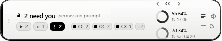
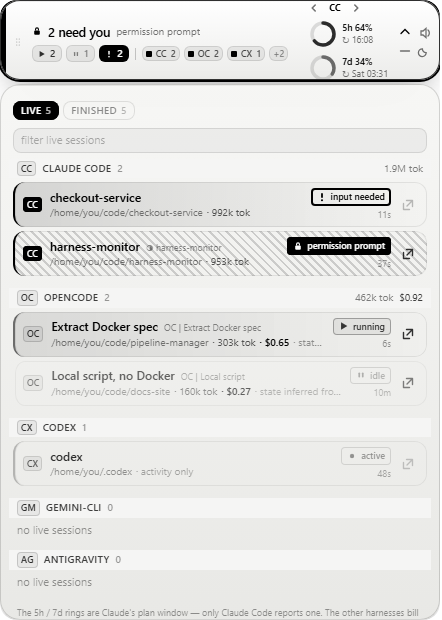
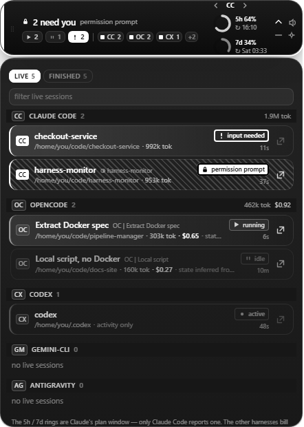
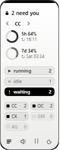
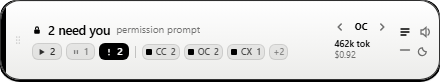
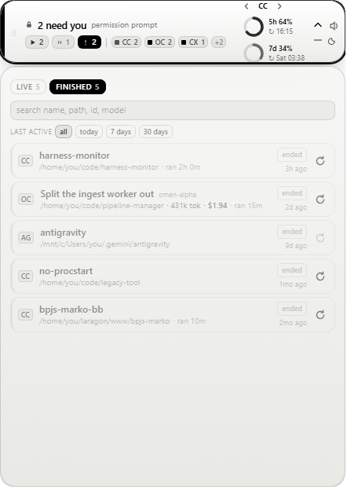
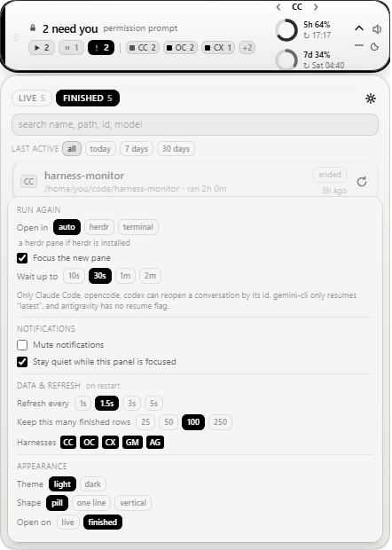

# HarnessMonitor

[](https://github.com/localhost94/harness-monitor/actions/workflows/ci.yml)
[](https://codecov.io/gh/localhost94/harness-monitor)
[](https://github.com/localhost94/harness-monitor/releases/latest)
[](LICENSE)

A floating widget that tells you the moment an AI coding agent stops working
and starts waiting for you.

It watches Claude Code, opencode, codex, gemini-cli and antigravity at the same
time, shows which sessions are running, idle or blocked on you, and how much of
the Claude 5-hour plan window is gone. Everything is read from files those tools
already write on your own machine: no backend, no network calls, no API keys.



The surface never changes with state - only the weight of the ink does: the
rail down the left edge, the glyph and its motion, and a keyline around the
whole pill when something is waiting on you. Click the list icon and it expands
into the session list, where the arrow on each row jumps straight to the
terminal pane running that session.

| Expanded, light | Expanded, dark | Vertical strip |
|---|---|---|
|  |  |  |

## Contents

[Install](#install) &middot;
[Why it reads what it reads](#why-it-reads-what-it-reads) &middot;
[Architecture](#architecture) &middot;
[Reading the pill](#reading-the-pill) &middot;
[Finished sessions](#finished-sessions) &middot;
[Jump to a session](#jump-to-a-session) &middot;
[Run a finished session again](#run-a-finished-session-again) &middot;
[Settings](#settings) &middot;
[Notification rules](#notification-rules) &middot;
[Usage numbers](#usage-numbers) &middot;
[Harness support](#harness-support) &middot;
[Build and run](#build-and-run) &middot;
[Why not one of the others](#why-not-one-of-the-others) &middot;
[Documentation](#documentation) &middot;
[Known limits](#known-limits) &middot;
[Contributing](#contributing) &middot;
[License](#license)

## Install

### Windows

Grab the `.exe` for your architecture **and** `harness-monitor-agent` from the
[latest release](../../releases/latest), keep them in the same folder, and run
the `.exe`:

| Your Windows | Take these two |
|---|---|
| Intel / AMD (most machines) | `harness-monitor-x64.exe` + `harness-monitor-agent-x64` |
| Snapdragon / ARM64 | build it yourself with `scripts/build-windows.sh` + `harness-monitor-agent-arm64` |

CI publishes the x64 exe only. For ARM64 the agent is published but the exe is
not, so cross-compile it from WSL - see [Build and run](#build-and-run).

Rename the agent to `harness-monitor-agent` (or point at it with
`HM_AGENT_PATH`) and keep it beside the `.exe`. The two must match your
architecture: the app launches the agent **inside WSL**, so an x86_64 agent
will not run on an ARM64 machine's WSL, and vice versa.

Windows 10/11 with WSL2 installed.

### macOS (experimental)

Take `HarnessMonitor-universal.dmg` from the same release - one file, no agent
half. macOS runs the adapters in-process the way Linux does, so there is
nothing to pair it with and nothing to arch-match; the dmg is universal. Drag
the app into `/Applications`.

The build is **unsigned** - there is no Apple Developer Program behind this
project - so Gatekeeper refuses the first launch. Either right-click the app
and pick *Open*, or clear the quarantine flag once:

```bash
xattr -dr com.apple.quarantine /Applications/HarnessMonitor.app
```

Experimental for two reasons: no release is smoke-tested on a Mac, and dead
sessions are not filtered there. See [Known limits](#known-limits).

### Linux

Build from source (see below) and run the binary directly.

## Why it reads what it reads

Claude Code writes one file per CLI process to `~/.claude/sessions/<pid>.json`
carrying an authoritative `status` (`idle|busy|waiting|shell`) and `waitingFor`
(`input needed` / `permission prompt`). "Finished" versus "needs you" is read,
never guessed.

Two traps that shape the whole design:

- **Nothing cleans that directory up.** On the development machine: 61 files,
  5 live processes, with dead ones frozen mid-turn for months. Every entry is
  verified against `/proc/<pid>/stat` field 22 before it is shown; the ones
  that fail are listed as finished rather than dropped, and neither list can
  notify. Matching on process *name* would not work either - a live Claude Code
  process is named after its version (`2.1.259`), not `claude`.
- **`sessionId` is not unique.** Resuming a session reuses the id under a new
  pid. Session identity is `(pidDomain, pid, procStart)`.

## Architecture

One crate, one binary, two roles.

```
UI role (default)                  agent role (--agent)
  window + tray                      no GUI
  differ + notifications             runs the adapters
  reads NDJSON  <--- stdout ----     one snapshot per line
```

On **Windows** the UI process spawns `wsl.exe -d <distro> -- <binary> --agent`
and reads snapshots from its stdout. It does not read `\\wsl.localhost`: a
Linux pid is meaningless to a Windows process (they are separate pid
namespaces, so the ghost filter above could not run), and opencode's WAL
database cannot be opened safely over a 9p share. On **Linux/WSLg** the
adapters run in-process and the agent role is unused.

Only the UI role is single-instance. Two copies would fight over the same
database, the same window position and the same notification stream, and there
would be no way to tell which one is the real monitor - so a second launch
brings the running window back to the front and exits. `--agent` is a
one-shot producer and is deliberately exempt; so is `--test-notify`, which you
run *while* the app is up to check whether toasts work here. On Linux the
guarantee falls back to a pid lock file on a host with no D-Bus session bus,
which blocks the second copy but cannot raise the first one's window (see
[Known limits](#known-limits)).

Adapters return a full snapshot each tick and nothing else - liveness,
transitions, dedup and delivery all live in `differ.rs`, once, for every
harness. Polling is the primary mode by design: `ReadDirectoryChangesW` does
not work over 9p and inotify does not fire on drvfs `/mnt/c`, so a filesystem
watcher would be a fallback that never runs.

## Reading the pill

The pill is 440x80 and comes in **two themes, light and dark**, both strictly
black and white - no hue anywhere in the interface. That is a deliberate bet
against camouflage, because a grey widget on a grey desktop is exactly what an
editor looks like, and this one floats over editors by design. So the surfaces
sit at the extremes instead of the middle: true white on true black, a hard
1px keyline all the way round, and a deep drop shadow. A terminal has a
background but no keyline; an editor has neither. The pill reads as a printed
card that happens to be on screen, and it cannot be mistaken for another pane.

State never repaints the surface. It is carried by **value**: the rail down the
left edge is full ink when something is waiting on you, 70% for a running turn,
30% for idle and a hairline for nothing at all; the headline glyph and its
motion; a keyline drawn around the whole pill when a session is blocked; and
the density of the row fills in the list. Nothing in the widget is a colour
you have to learn.

Next to the headline sit three counts, always in the same order so they can be
read by position: **running / idle / waiting for you**. Zeroes stay visible but
dim - "nothing is waiting" is information, and a vanishing chip would shift the
other two. After a divider come the per-harness counts; harnesses that are
installed but idle collapse into a `+N` chip that still names them on hover.

Each row carries its own usage — tokens for every harness that reports them,
plus cost where the harness knows it (opencode does; a Claude subscription has
no per-session price to report). Harness headers total their group. Claude
Code's figures come from tailing the session transcript, so they are a running
total from when the app first saw that session.

On the right sits the **usage pager**: `‹ CC ›` steps through the detected
harnesses, and the choice is remembered. Claude Code is the default because it
is the only one with a plan window - its page shows **both windows**, 5-hour and
7-day, each as a ring paired with its figure - `5h 64%` on one line, the wall-clock reset time
under it (`↻ 12:22`, or `↻ Fri 00:05` when the reset is days out). The
percentage sits in the label rather than inside the ring, where `64%` cannot be
drawn legibly at 30px and a bare `64` reads as a count. A countdown
answers "how long"; a clock answers "when can I start again", which is the
thing you plan around. Hovering gives both, plus which source the reading came
from.

Every other harness pages to what it actually reports - tokens, and cost where
it knows one (`462k tok / $0.92`), or an explicit "no usage reported" rather
than a zero that would read as free.



**Only Claude Code has a plan window.** The others bill per token and expose no
equivalent, which is exactly why this pages instead of blending: a percentage of
a subscription and a token count are not comparable numbers, and stacking them
in one row would imply they are.

Per-session state is carried four ways - shape, motion, ink weight and texture -
so nothing depends on a channel a single glance could miss:

| State | Glyph | Motion | Row |
|---|---|---|---|
| running | play | breathes (2.2s) | 10% ink wash, hairline rule |
| needs input | `!` | blinks (1s) | 13% wash, solid 2px rule |
| needs approval | lock | blinks (1s) | 10% wash over a diagonal caution hatch |
| idle | pause | still | no fill, no rule, 60% opacity |
| activity only | dot | breathes | 30% rule, "activity only" note |

The state chip is ranked the same way: a request for approval is a solid stamp
of ink, a request for input is a hollow one with a 2px keyline, work in
progress is a hairline outline, and anything passive is a ghost. `prefers-reduced-motion` disables the animation, which is also why the motion is never the only cue.

Harnesses are told apart by a two-letter chip and nothing else - CC (Claude
Code), OC (opencode), CX (codex), GM (gemini-cli), AG (antigravity) - and the
chip goes solid when that harness has something waiting on you. A harness that
is installed but quiet shows a hollow mark and a dimmed `0`; one that is not
installed is absent entirely.

When there are more sessions than fit, the list scrolls: harness headers stick
to the top so you always know which group you are reading, and anything waiting
on you sorts first - both between harnesses and inside each one - so a dozen
running sessions cannot push a blocked one below the fold.

**Three shapes**, cycled by one button, because where your screen is free
decides which one you want:

| Shape | Size | For |
|---|---|---|
| Pill | 440x80 | The bottom of a screen. Headline and counts on one line, quota rings and buttons on the right |
| One line | 440x44 | Anywhere. The same answer in a strip that costs half the screen, harness chips dropped because that detail is what the taller pill has room for |
| Vertical | 118x300 | A side edge. Rail across the top, headline, quota, the three counts as full-width rows (glyph and word left, figure hard right), harness chips in two columns |

The vertical strip spells the counts out in words: with no headline beside
them, an icon and a number alone do not say what is being counted. The one-line
shape keeps both quota rings - a shorter widget could have dropped them, but the
rings are the only place the plan window appears at all - and only loses the
reset clock, which moves into the tooltip and is back at full size as soon as
the list is open.

Expanding any shape opens the same 440-wide session list, because rows are not
readable in a 118px strip. The choice is remembered across restarts.

Drag anywhere on the pill or strip (buttons and the session list excluded); the
position is remembered too. The four icon buttons are expand/collapse, mute,
shape, and light/dark.

## Finished sessions

The live list answers "what needs me". It cannot answer "what did I run",
because it is empty the moment the work stops - which is exactly when you want
to look. So the panel has two tabs: **live** and **finished**, the second
carrying its own count.

They are different views rather than one list with a filter, because they are
different questions. "What needs me" wants grouping by harness and whatever is
blocked first; "what did I run" wants a flat reverse-chronological run with a
search box and a date range. One list trying to be both is worse at both.



The finished view is the data the app used to throw away. On this machine
`~/.claude/sessions` holds 61 files and 5 live processes; the rest are sessions
from months ago, each still frozen at whatever status it died holding - usually
`busy`, which is why listing them as *idle* would be a lie about a process that
does not exist. Finished rows say `ended` and how long ago they were last
touched, capped at 100 per harness (now a setting).

There is one thing a finished row can do, and it is not jumping: it can be
[reopened](#run-a-finished-session-again). A row carries a session id and a
directory, which is enough to start the same harness on the same conversation -
but not enough to replay it, because no adapter records the command or the prompt
that started the session.

**Search** covers name, working directory, session id, model, terminal title and
harness. Space-separated words all have to match, so a second word narrows the
result - a filter that returns *more* rows as you type more is worse than none.
The session id is in there because antigravity has nothing else to go on.

**Last active** filters by range: today, 7 days, 30 days, or all. "Today" is
local midnight, not the last 24 hours, because a date filter that shows you
yesterday evening when you ask about today is the kind of off-by-one that makes
you stop trusting it. The timestamp being filtered is the last time the harness
wrote to the session, which is the only one every adapter fills in; the exact
time is in each row's tooltip behind the relative "2d ago".

What decides "finished" depends on what the harness can tell us:

| Harness | Finished means |
|---|---|
| Claude Code | The pid is gone. `procStart` is checked against `/proc`, because pids get recycled and process names are useless here - a live Claude Code process is called `2.1.259`, not `claude` |
| opencode, codex, gemini-cli | The row fell outside the harness's own 12-hour recency window. There is no process per session to check, so "not recent" is the whole of the claim |
| antigravity | A conversation file older than 10 minutes. Its conversations are binary protobuf with no schema, so a finished row carries the id and the timestamp and nothing else |

On macOS nothing can be verified - there is no procfs - so every Claude Code
session is filed as finished rather than shown as live. "Cannot be disproved" is
not evidence.

**These rows can never raise a notification.** They live in a separate list in
the snapshot that the differ never reads, which is a structural guarantee rather
than a filter someone has to remember to apply. Two integration tests hold that
line: ghosts are listed and produce zero toasts, and a session that appears in
both lists during a refresh fires exactly one.

## Jump to a session

The list answers "which agent needs me"; the arrow on each row answers "where
is it". Clicking it focuses the terminal pane running that session.

This works through herdr - a terminal workspace manager for AI coding agents -
and only for sessions it hosts. herdr's panes already
know which agent session they contain, so the app maps session id to pane id
via `herdr agent list` and then calls `herdr agent focus <pane>`. A session id
is not itself a valid focus target, hence the mapping.

The Windows build cannot reach herdr directly (it lives in WSL, and
`~/.local/bin` is not on PATH for a non-interactive `wsl.exe --` shell), so it
re-invokes this same binary inside WSL in one-shot mode:
`harness-monitor-agent --focus <pane>`.

Without herdr the arrow greys out and says why; rows still show the terminal
tab title when it is known, which is usually enough to find the window by eye.

## Run a finished session again

The live list answers "where is it". The finished list answers "put me back in
it": every row there carries a button that reopens that conversation in a
terminal.

A finished row has no pane to focus, which is why it never had a button. It does
have a session id and a working directory, and that is enough to relaunch the
same harness on the same conversation - so the button is **reopen**, not **jump**,
and the two are deliberately different glyphs.

**This is not a replay.** No adapter records the command, the argv or the prompt
a session started with, so there is nothing to replay from. What the button does
is start the harness again on the same conversation:

| Harness | Button | Command |
|---|---|---|
| Claude Code | works | `claude --resume <id>` |
| opencode | works | `opencode --session <id>` |
| codex | works | `codex resume <id>` |
| gemini-cli | **disabled** | `--resume` takes only `latest` or an index, never a session id |
| antigravity | **disabled** | no resume flag, and the conversation lives under `~/.gemini/antigravity` rather than a project |

Those two rows carry a button that is disabled and says why, because a greyed
control with no explanation is a bug report and an enabled one that quietly opens
*some other* conversation is worse.

**Where it opens.** With herdr installed, `pane split --cwd <dir>` then
`agent start --kind <harness> --pane <pane>`, which waits for the agent to become
interactive. The new pane is at the session's own directory, and the split goes
wherever your focus is - herdr's own behaviour, and the alternative (jumping you
to a random workspace) would be worse.

A new pane is not at a shell prompt the instant it exists, and herdr refuses to
start an agent in a pane that is not sitting at one, so the launch retries on
that one error code until the shell catches up. There is no readiness field to
poll - `pane get` reports nothing for a bare shell - so herdr's refusal is the
signal.

**Without herdr** there is no addressable terminal, so the fallback opens a new
one: `x-terminal-emulator`, `gnome-terminal`, `konsole`, `alacritty`, `kitty`,
`wezterm`, `foot` or `xterm`, first on PATH wins; on macOS, AppleScript into
Terminal or iTerm. If neither herdr nor a terminal can be found, the button says
which was missing. On **Windows without herdr** it says so and stops - the only
remaining option would be shelling out to `wt.exe` from inside WSL, which is not
implemented because it could not be tested from the machine it was written on.

Settings → *Run again* controls the launch target, whether the new pane is
focused, and how long to wait for the agent.

## Settings

A gear in the panel header, next to the live and finished tabs. It is not on the
pill: the pill's four buttons sit in a 2x2 that 80px of height cannot grow, and a
fifth icon is a worse answer than one more click.



The controls are grouped by **when the value takes effect**, because that is the
thing you cannot otherwise see:

| Group | Settings | Applies |
|---|---|---|
| Run again | launch target, focus the new pane, wait up to | immediately |
| Notifications | mute, stay quiet while the panel is focused | immediately |
| Data & refresh | refresh interval, finished-row cap, enabled harnesses | **on restart** |
| Appearance | theme, widget shape, which tab opens first | immediately |

The restart-gated group is marked in its heading, and a note at the bottom appears
only once you have actually changed one of them.

**Two stores, on purpose.** Appearance is read synchronously while the store is
created, because a floating widget is on screen before any IPC has resolved and
getting it wrong means a visible flash of the wrong theme. Those three live in
`localStorage`. Everything the *running pipeline* reads - including the scan
settings the WSL agent is started with - lives in one `settings.json`. The rule
is whether the **first render** or the **running pipeline** needs the value.

`settings.json` is read and written only by the UI process. On Windows the
scanner is a separate process inside WSL, so anything it needs is handed over as
a command-line argument when the UI spawns it:

```
harness-monitor-agent --agent --interval-ms 3000 --max-ended 250 --harnesses claude-code,codex
```

and the same for the one-shot that reopens a session:

```
harness-monitor-agent --run-again <harness> <session-id> <cwd> --rerun-target auto --rerun-focus
```

That is why scan settings need a restart and everything else does not, and why
there is no control channel into the agent.

A file that is missing, truncated, or written by a future version falls back to
the defaults rather than stopping the app, and every numeric value is clamped -
`interval_ms: 0` would otherwise have the scanner spinning a core with no pause.

**Mute now survives a restart**, which it did not before: it lived in an
`AtomicBool` and came back unmuted every time.

## Notification rules

Noise control is most of the work:

| Rule | Behaviour |
|---|---|
| Silent seed | The first snapshot - and the first after an agent respawn - sets the baseline and emits nothing |
| Edge, not level | Fires on the harness's own `statusUpdatedAt` advancing *and* the state class changing, so a transition that happened between two polls is still caught |
| Two kinds only | `needs you` (→ waiting) and `finished` (busy → idle). Sessions appearing, disappearing, or going busy are never announced |
| Cooldown | 30 s per session, absorbing the busy↔idle flapping between tool calls |
| Repeat guard | A second "needs you" for the same reason within 5 minutes is dropped |
| Global cap | 3 toasts per 10 s; the rest collapse into one summary |
| Ghosts | A session that fails the liveness check never enters the notification pipeline at all - a deleted state file is not a completed turn |

## Usage numbers

The 5-hour percentage is **mirrored** from Claude Code, never derived from
token counts (the server's own figures make clear why: `extra_used_credits`
of 50253 against a limit of 10000, with the percentage field clamped at 100).

Two sources, newest reading wins:

1. `~/.local/state/harness-monitor/quota.json`, written by the statusline shim
   on every statusline render;
2. `~/.claude/llm-analytics-usage/*.jsonl`, written by a `Stop` hook if you
   have one - coarser, but needs no install.

Both are push-only from a live Claude Code process, so with every session
closed the number freezes. It is then greyed out with its age rather than
extrapolated forward.

To install the shim (wraps your existing statusline, does not replace it, safe
to re-run):

```bash
./installer/install-statusline.sh --status     # look before you leap
./installer/install-statusline.sh --install
./installer/install-statusline.sh --uninstall
```

## Harness support

| Harness | State | Usage | Source |
|---|---|---|---|
|  **Claude Code** | full - reported by the harness | plan window | `~/.claude/sessions/*.json` |
|  **opencode** | running/idle, inferred | cost + 5 token counters | `opencode.db` (`session`, `message`) |
|  **codex** | running/idle, inferred | `tokens_used` | `state_5.sqlite`, `queue_1.sqlite` |
|  **gemini-cli** | recency only | per-message tokens | `~/.gemini/tmp/*/chats/*.json` |
|  **antigravity** | activity only | none | protobuf conversations (mtime) |

The UI labels anything below full fidelity, so an inferred state is never
mistaken for a reported one. opencode permission prompts are deliberately not
detected: the only record is a log line with no session id and no matching
"resolved" event, so a state machine built on it would latch forever.

## Build and run

Everywhere: [bun](https://bun.sh) 1.3.12+ and a stable Rust toolchain (1.77 or
newer, per `src-tauri/Cargo.toml`). The frontend is built once, then the Rust
side embeds it.

```bash
bun install
bun run build

cd src-tauri
cargo test                 # 218 tests, no GUI needed
cargo run                  # runs the app against your real sessions
cargo run -- --agent       # NDJSON snapshots on stdout
```

`cargo run` works on Linux/WSLg and macOS. On Windows the app expects to drive
an agent inside WSL, so use the script further down instead.

A release build needs `--features custom-protocol`; without it the webview
loads `devUrl` instead of the embedded assets and the app opens on "localhost
failed to connect". The `tauri` CLI passes that feature for you, plain `cargo`
does not, and the failure only shows up in a shipped build. If you ever see
that error, check the log for `frontend connected` - its absence is the tell.

### Linux

```bash
sudo apt-get install -y libwebkit2gtk-4.1-dev libsoup-3.0-dev \
  libjavascriptcoregtk-4.1-dev libgtk-3-dev librsvg2-dev patchelf

bun x tauri build --bundles deb,appimage
```

The webview stack is needed even for `cargo test`, because the crate links
against it.

### macOS

```bash
xcode-select --install     # rusqlite is vendored, so a C compiler is required

bun x tauri build --bundles dmg
bun x tauri build --target universal-apple-darwin --bundles dmg   # both arches
```

Unsigned output is fine locally, but Apple Silicon will not launch a binary
carrying no signature at all - set `APPLE_SIGNING_IDENTITY=-` to have Tauri
ad-hoc sign it, which is what CI does.

Two macOS notes that bite during development: desktop notifications only work
from the bundled `.app` (an unbundled `cargo run` has no registered bundle id,
so toasts silently do nothing), and state lands in
`~/.local/state/harness-monitor`, not `~/Library/Application Support`.

### Windows

Needs the MSVC build tools and the WebView2 runtime. Native build:

```bash
bun x tauri build --bundles nsis
```

Windows ARM cross-compiled from WSL, shipping both halves:

```bash
./scripts/build-windows.sh
```

That produces `dist-windows/harness-monitor.exe` plus
`dist-windows/harness-monitor-agent`, the Linux binary the exe launches through
`wsl.exe`. Keep them side by side, or point at the agent with `HM_AGENT_PATH`;
the distro comes from `HM_WSL_DISTRO`, else the first entry of `wsl.exe -l -q`.

### Previewing the UI

To review the UI without a desktop (or to check both themes at once):

```bash
./scripts/preview.sh 440 620 preview.png          # light, expanded
./scripts/preview.sh 440 620 preview.png theme=dark
./scripts/preview.sh 440 620 preview.png view=finished settings=1
```

It builds, serves the built assets, and screenshots through headless Chrome.
Three things it works around, all of which silently produce a wrong picture:
`vite dev` never sees edits under `/mnt/c` (inotify does not fire on drvfs);
Chrome enforces a ~500px minimum window width, so a 440px widget would otherwise
be a crop of a 512px layout; and because of that same minimum the raw
screenshot carries a dead margin down the right, so the last step crops it back
to the size you asked for. Anything after the three arguments becomes a query
param, one per argument - `theme=dark`, `collapsed`, `shape=vertical`,
`view=finished`, `q=api`, `dates=today`, `many=12`, `settings=1`, `only=idle`.
Opened in a plain browser the app renders fixture data covering every state,
since real sessions are rarely all interesting at once.

## Why not one of the others

Several tools now watch AI coding sessions, and they are solving a different
shape of the problem:

| | Shape | Where it runs |
|---|---|---|
| **HarnessMonitor** | A floating pill or strip that interrupts you when a session finishes or blocks, and otherwise stays out of the way | Windows + WSL2, Linux, or macOS (experimental) |
| [agentpulse](https://github.com/jstuart0/agentpulse) | A full dashboard with prompts, responses and session history | Browser |
| [AgentBar](https://github.com/scari/AgentBar) | Menu-bar usage tracking | macOS |
| [agent-deck](https://github.com/asheshgoplani/agent-deck) | A TUI session manager - launch and switch sessions | Terminal |
| [AgentDeck](https://github.com/puritysb/AgentDeck) | A physical control surface, one key per session | Stream Deck and friends |

Pick this one if you want to be told rather than to watch, if you are on
Windows with your agents inside WSL, or if you want five harnesses in one place
with honest labelling of how much each one actually reports. Pick a dashboard
if you want to read transcripts, or the TUI if you want to drive sessions from
one place.

## Documentation

| Document | What is in it |
|---|---|
| [ARCHITECTURE.md](docs/ARCHITECTURE.md) | Why the Windows build talks to WSL, why there is no filesystem watcher, the differ's rules and what each one prevents |
| [CONTRIBUTING.md](CONTRIBUTING.md) | The adapter contract, and the rules a new harness has to keep |
| [CHANGELOG.md](CHANGELOG.md) | Releases, and the limitations shipped with each |
| [SECURITY.md](SECURITY.md) | What counts as a vulnerability here, and how to report it privately |
| [CODE_OF_CONDUCT.md](CODE_OF_CONDUCT.md) | Contributor Covenant 2.1 |

## Known limits

- **Linux toasts go through the xdg desktop portal.** A stock WSL has no
  `org.freedesktop.Notifications` daemon (no dunst/mako/notify-send), and the
  notification plugin talks to that name directly, so on Linux the app calls
  `org.freedesktop.portal.Notification` over D-Bus itself and only falls back
  to the plugin. The portal accepts the call here; whether WSLg surfaces it
  visually varies, so check before trusting it:

  ```bash
  cargo run -- --test-notify
  ```

  If nothing appears, sessions are still tracked in the window - the app says
  which path it is using at startup rather than failing silently.
- **On a Linux host with no D-Bus session bus, a second copy exits silently.**
  The usual single-instance handshake rides on a D-Bus name there, and a stock
  WSL may not have a bus at all. Rather than let that panic at startup, the app
  falls back to a pid lock file in its state dir, which still stops the second
  copy - but there is no channel back to the first process, so the window is
  not raised. Use the tray icon to show it. A lock left by a crash is detected
  and reclaimed on the next launch.
- The Windows release build has no console. Set `HM_LOG_FILE` to a writable
  path to get a log (`frontend connected`, `starting wsl agent`, snapshot
  counts); that is the fastest way to tell a webview problem from a bridge
  problem.
- Always-on-top under WSLg is best-effort - WSLg composites X/Wayland windows
  into the Windows desktop and does not reliably honour the hint.
- **On macOS, liveness cannot be established.** The check is a `procStart`
  comparison against `/proc/<pid>/stat`, which macOS does not have, so every pid
  comes back `Unknown`. An unverifiable session is filed as finished rather than
  shown as live - it never reaches the pill's counts or the differ - but that
  means the live list is empty on a Mac where Claude Code is running. Fixing it
  needs a `sysctl(KERN_PROC_PID)` implementation, and before that, knowledge of
  what Claude Code writes into `procStart` there: the Linux value is kernel
  ticks since boot and cannot be it.
- **Antigravity is unavailable on macOS.** Its root is found by scanning
  `/mnt/c/Users` for a Windows home, which only exists under WSL.
- macOS builds are unsigned and not smoke-tested per release. Gatekeeper blocks
  the first launch until you clear the quarantine flag (see Install).
- Quota is Claude-only. Other harnesses have their own independent limits, so
  a single blended "usage" number across harnesses would be fiction; their
  cost is shown separately.

## Contributing

Issues and pull requests are welcome. [CONTRIBUTING.md](CONTRIBUTING.md) has the
adapter contract and the rules a new harness has to keep; the short version is
that `cargo test` and `cargo clippy --all-targets` must be clean, and a UI
change wants a screenshot from `scripts/preview.sh` in both themes.

By taking part you agree to the [Code of Conduct](CODE_OF_CONDUCT.md).

## License

[MIT](LICENSE).

Harness names and logos belong to their respective owners and are used here to
identify what this tool reads. No affiliation or endorsement is implied.
